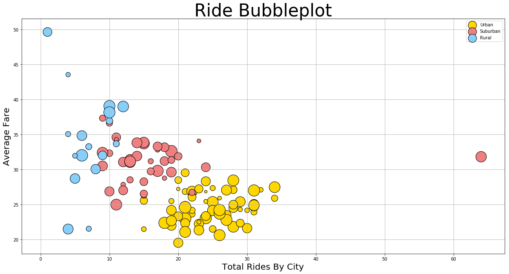
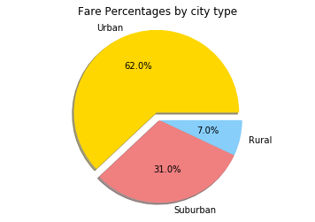
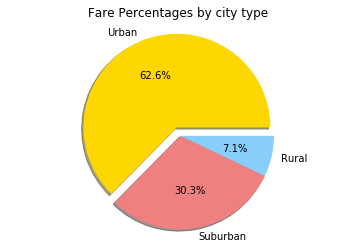
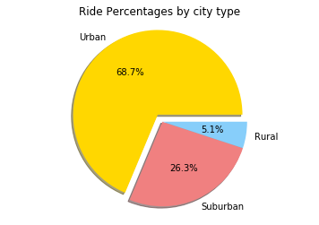

```python
import pandas as pd
import matplotlib.pyplot as plt

```


```python
city = pd.read_csv('city_data.csv')
rides = pd.read_csv('ride_data.csv')
pyberdf=pd.merge(rides,city, how="outer")
pyberdf.head()


```


<div>
<style scoped>
    .dataframe tbody tr th:only-of-type {
        vertical-align: middle;
    }

    .dataframe tbody tr th {
        vertical-align: top;
    }

    .dataframe thead th {
        text-align: right;
    }
</style>
<table border="1" class="dataframe">
  <thead>
    <tr style="text-align: right;">
      <th></th>
      <th>city</th>
      <th>date</th>
      <th>fare</th>
      <th>ride_id</th>
      <th>driver_count</th>
      <th>type</th>
    </tr>
  </thead>
  <tbody>
    <tr>
      <th>0</th>
      <td>Sarabury</td>
      <td>2016-01-16 13:49:27</td>
      <td>38.35</td>
      <td>5403689035038</td>
      <td>46</td>
      <td>Urban</td>
    </tr>
    <tr>
      <th>1</th>
      <td>Sarabury</td>
      <td>2016-07-23 07:42:44</td>
      <td>21.76</td>
      <td>7546681945283</td>
      <td>46</td>
      <td>Urban</td>
    </tr>
    <tr>
      <th>2</th>
      <td>Sarabury</td>
      <td>2016-04-02 04:32:25</td>
      <td>38.03</td>
      <td>4932495851866</td>
      <td>46</td>
      <td>Urban</td>
    </tr>
    <tr>
      <th>3</th>
      <td>Sarabury</td>
      <td>2016-06-23 05:03:41</td>
      <td>26.82</td>
      <td>6711035373406</td>
      <td>46</td>
      <td>Urban</td>
    </tr>
    <tr>
      <th>4</th>
      <td>Sarabury</td>
      <td>2016-09-30 12:48:34</td>
      <td>30.30</td>
      <td>6388737278232</td>
      <td>46</td>
      <td>Urban</td>
    </tr>
  </tbody>
</table>
</div>


```python
#showing city data which contains total driver counts per city to calculate percentages later
city.head(5)
```


<div>
<style scoped>
    .dataframe tbody tr th:only-of-type {
        vertical-align: middle;
    }

    .dataframe tbody tr th {
        vertical-align: top;
    }

    .dataframe thead th {
        text-align: right;
    }
</style>
<table border="1" class="dataframe">
  <thead>
    <tr style="text-align: right;">
      <th></th>
      <th>city</th>
      <th>driver_count</th>
      <th>type</th>
    </tr>
  </thead>
  <tbody>
    <tr>
      <th>0</th>
      <td>Kelseyland</td>
      <td>63</td>
      <td>Urban</td>
    </tr>
    <tr>
      <th>1</th>
      <td>Nguyenbury</td>
      <td>8</td>
      <td>Urban</td>
    </tr>
    <tr>
      <th>2</th>
      <td>East Douglas</td>
      <td>12</td>
      <td>Urban</td>
    </tr>
    <tr>
      <th>3</th>
      <td>West Dawnfurt</td>
      <td>34</td>
      <td>Urban</td>
    </tr>
    <tr>
      <th>4</th>
      <td>Rodriguezburgh</td>
      <td>52</td>
      <td>Urban</td>
    </tr>
  </tbody>
</table>
</div>


```python
#splitting into 3 dfs
Urban=pyberdf.loc[pyberdf["type"]=="Urban"] 
Suburban=pyberdf.loc[pyberdf["type"]=="Suburban"]
Rural=pyberdf.loc[pyberdf["type"]=="Rural"]


```


```python
#calculating averages and counts per city type
Urban2=Urban.groupby(['city'])
urbanavgpercity=Urban2['fare'].mean()
urbanridespercity=Urban2['ride_id'].count()
urbantotalpercity=Urban2['fare'].sum()

totalurbanfares=urbantotalpercity.sum()
totalurbanrides=urbanridespercity.sum()


Suburb=Suburban.groupby(['city'])
suburbanavgpercity=Suburb['fare'].mean()
suburbanridespercity=Suburb['ride_id'].count()
suburbantotalpercity=Suburb['fare'].sum()

totalsuburbanfares=suburbantotalpercity.sum()
totalsuburbanrides=suburbanridespercity.sum()

Rural2=Rural.groupby(['city'])
ruralavgpercity=Rural2['fare'].mean()
ruralridespercity=Rural2['ride_id'].count()
ruraltotalpercity=Rural2['fare'].sum()

totalruralfares=ruraltotalpercity.sum()
totalruralrides=ruralridespercity.sum()

urbandrivers1 = Urban.drop_duplicates(subset=["city","driver_count"], keep='first')
suburbandrivers1 = Suburban.drop_duplicates(subset=["city","driver_count"], keep='first')
ruraldrivers1 = Rural.drop_duplicates(subset=["city","driver_count"], keep='first')
urbandriverspercity = urbandrivers1.groupby("city")["driver_count"].sum()
suburbandriverspercity = suburbandrivers1.groupby("city")["driver_count"].sum()
ruraldriverspercity = ruraldrivers1.groupby("city")["driver_count"].sum()

#Totals
totaldrivers = city["driver_count"].sum()
totalfares= pyberdf["fare"].sum()
totalrides= pyberdf["ride_id"].count()

urbandrivers2 = city.loc[city["type"] =="Urban"]
suburbandrivers2 = city.loc[city["type"] =="Suburban"]
ruraldrivers2 = city.loc[city["type"] =="Rural"]
urbandrivertotal=urbandrivers2["driver_count"].sum()
suburbandrivertotal=suburbandrivers2["driver_count"].sum()
ruraldrivertotal=ruraldrivers2["driver_count"].sum()


```


```python
#dataframes for each type
Urbandf=pd.DataFrame({"Average Fare": urbanavgpercity,
                     "Total Rides": urbanridespercity,
                     "Total Drivers": urbandriverspercity},
                    columns=["Average Fare","Total Rides","Total Drivers"])


Suburbandf=pd.DataFrame({"Average Fare": suburbanavgpercity,
                     "Total Rides": suburbanridespercity,
                     "Total Drivers": suburbandriverspercity},
                    columns=["Average Fare","Total Rides","Total Drivers"])

                                       
Ruraldf=pd.DataFrame({"Average Fare": ruralavgpercity,
                     "Total Rides": ruralridespercity,
                     "Total Drivers": ruraldriverspercity},
                    columns=["Average Fare","Total Rides","Total Drivers"])

                                       
Urbandf["City Type"] = "Urban"
Suburbandf["City Type"] = "Suburban"
Ruraldf["City Type"] = "Rural"

totaldf=Urbandf
totaldf=totaldf.append(Suburbandf)
totaldf=totaldf.append(Ruraldf)
totaldf.head()
```


<div>
<style scoped>
    .dataframe tbody tr th:only-of-type {
        vertical-align: middle;
    }

    .dataframe tbody tr th {
        vertical-align: top;
    }

    .dataframe thead th {
        text-align: right;
    }
</style>
<table border="1" class="dataframe">
  <thead>
    <tr style="text-align: right;">
      <th></th>
      <th>Average Fare</th>
      <th>Total Rides</th>
      <th>Total Drivers</th>
      <th>City Type</th>
    </tr>
    <tr>
      <th>city</th>
      <th></th>
      <th></th>
      <th></th>
      <th></th>
    </tr>
  </thead>
  <tbody>
    <tr>
      <th>Alvarezhaven</th>
      <td>23.928710</td>
      <td>31</td>
      <td>21</td>
      <td>Urban</td>
    </tr>
    <tr>
      <th>Alyssaberg</th>
      <td>20.609615</td>
      <td>26</td>
      <td>67</td>
      <td>Urban</td>
    </tr>
    <tr>
      <th>Antoniomouth</th>
      <td>23.625000</td>
      <td>22</td>
      <td>21</td>
      <td>Urban</td>
    </tr>
    <tr>
      <th>Aprilchester</th>
      <td>21.981579</td>
      <td>19</td>
      <td>49</td>
      <td>Urban</td>
    </tr>
    <tr>
      <th>Arnoldview</th>
      <td>25.106452</td>
      <td>31</td>
      <td>41</td>
      <td>Urban</td>
    </tr>
  </tbody>
</table>
</div>


```python
Urbandf.head(5)
```


<div>
<style scoped>
    .dataframe tbody tr th:only-of-type {
        vertical-align: middle;
    }

    .dataframe tbody tr th {
        vertical-align: top;
    }

    .dataframe thead th {
        text-align: right;
    }
</style>
<table border="1" class="dataframe">
  <thead>
    <tr style="text-align: right;">
      <th></th>
      <th>Average Fare</th>
      <th>Total Rides</th>
      <th>Total Drivers</th>
      <th>City Type</th>
    </tr>
    <tr>
      <th>city</th>
      <th></th>
      <th></th>
      <th></th>
      <th></th>
    </tr>
  </thead>
  <tbody>
    <tr>
      <th>Alvarezhaven</th>
      <td>23.928710</td>
      <td>31</td>
      <td>21</td>
      <td>Urban</td>
    </tr>
    <tr>
      <th>Alyssaberg</th>
      <td>20.609615</td>
      <td>26</td>
      <td>67</td>
      <td>Urban</td>
    </tr>
    <tr>
      <th>Antoniomouth</th>
      <td>23.625000</td>
      <td>22</td>
      <td>21</td>
      <td>Urban</td>
    </tr>
    <tr>
      <th>Aprilchester</th>
      <td>21.981579</td>
      <td>19</td>
      <td>49</td>
      <td>Urban</td>
    </tr>
    <tr>
      <th>Arnoldview</th>
      <td>25.106452</td>
      <td>31</td>
      <td>41</td>
      <td>Urban</td>
    </tr>
  </tbody>
</table>
</div>


```python
Suburbandf.head(5)
```


<div>
<style scoped>
    .dataframe tbody tr th:only-of-type {
        vertical-align: middle;
    }

    .dataframe tbody tr th {
        vertical-align: top;
    }

    .dataframe thead th {
        text-align: right;
    }
</style>
<table border="1" class="dataframe">
  <thead>
    <tr style="text-align: right;">
      <th></th>
      <th>Average Fare</th>
      <th>Total Rides</th>
      <th>Total Drivers</th>
      <th>City Type</th>
    </tr>
    <tr>
      <th>city</th>
      <th></th>
      <th></th>
      <th></th>
      <th></th>
    </tr>
  </thead>
  <tbody>
    <tr>
      <th>Anitamouth</th>
      <td>37.315556</td>
      <td>9</td>
      <td>16</td>
      <td>Suburban</td>
    </tr>
    <tr>
      <th>Campbellport</th>
      <td>33.711333</td>
      <td>15</td>
      <td>26</td>
      <td>Suburban</td>
    </tr>
    <tr>
      <th>Carrollbury</th>
      <td>36.606000</td>
      <td>10</td>
      <td>4</td>
      <td>Suburban</td>
    </tr>
    <tr>
      <th>Clarkstad</th>
      <td>31.051667</td>
      <td>12</td>
      <td>21</td>
      <td>Suburban</td>
    </tr>
    <tr>
      <th>Conwaymouth</th>
      <td>34.591818</td>
      <td>11</td>
      <td>18</td>
      <td>Suburban</td>
    </tr>
  </tbody>
</table>
</div>


```python
Ruraldf.head(5)
```


<div>
<style scoped>
    .dataframe tbody tr th:only-of-type {
        vertical-align: middle;
    }

    .dataframe tbody tr th {
        vertical-align: top;
    }

    .dataframe thead th {
        text-align: right;
    }
</style>
<table border="1" class="dataframe">
  <thead>
    <tr style="text-align: right;">
      <th></th>
      <th>Average Fare</th>
      <th>Total Rides</th>
      <th>Total Drivers</th>
      <th>City Type</th>
    </tr>
    <tr>
      <th>city</th>
      <th></th>
      <th></th>
      <th></th>
      <th></th>
    </tr>
  </thead>
  <tbody>
    <tr>
      <th>East Leslie</th>
      <td>33.660909</td>
      <td>11</td>
      <td>9</td>
      <td>Rural</td>
    </tr>
    <tr>
      <th>East Stephen</th>
      <td>39.053000</td>
      <td>10</td>
      <td>6</td>
      <td>Rural</td>
    </tr>
    <tr>
      <th>East Troybury</th>
      <td>33.244286</td>
      <td>7</td>
      <td>3</td>
      <td>Rural</td>
    </tr>
    <tr>
      <th>Erikport</th>
      <td>30.043750</td>
      <td>8</td>
      <td>3</td>
      <td>Rural</td>
    </tr>
    <tr>
      <th>Hernandezshire</th>
      <td>32.002222</td>
      <td>9</td>
      <td>10</td>
      <td>Rural</td>
    </tr>
  </tbody>
</table>
</div>


```python
Bubbleplot = Urbandf.plot(kind='scatter', x="Total Rides", y="Average Fare", color= "gold", edgecolor="black",
                         grid=True, figsize=(20,10), s=totaldf["Total Drivers"]*10, legend=True, label="Urban")
Suburbandf.plot(kind='scatter', x="Total Rides", y="Average Fare", color= "lightcoral", edgecolor="black",
                         grid=True, figsize=(20,10), s=totaldf["Total Drivers"]*10, legend=True, label="Suburban", ax=Bubbleplot,)
Ruraldf.plot(kind='scatter', x="Total Rides", y="Average Fare", color= "lightskyblue", edgecolor="black",
                         grid=True, figsize=(20,10), s=totaldf["Total Drivers"]*10, legend=True, label="Rural",ax=Bubbleplot,)

plt.xlabel("Total Rides By City",fontsize=20)
plt.ylabel("Average Fare",fontsize=20)
plt.title("Ride Bubbleplot",fontsize=40)
plt.show()
```





```python
urbanfarepercent=round((totalurbanfares/totalfares)*100)
suburbanfarepercent=round((totalsuburbanfares/totalfares)*100)
ruralfarepercent=round((totalruralfares/totalfares)*100)

urbanridepercent=round((totalurbanrides/totalrides)*100)
suburbanridepercent=round((totalsuburbanrides/totalrides)*100)
ruralridepercent=round((totalruralrides/totalrides)*100)

urbandriverpercent=round((urbandrivertotal/totaldrivers)*100)
suburbandriverpercent=round((suburbandrivertotal/totaldrivers)*100)
ruraldriverpercent=round((ruraldrivertotal/totaldrivers)*100)

```


```python
labels=["Urban","Suburban","Rural"]
sizes=[urbanfarepercent,suburbanfarepercent,ruralfarepercent]
colors=["gold","lightcoral","lightskyblue"]
explode=[0.1,0,0]
plt.pie(sizes,labels=labels,colors=colors,explode=explode,shadow=True,autopct="%1.1f%%",)
plt.title("Fare Percentages by city type")
plt.axis("equal")
plt.show()
```





```python
labels=["Urban","Suburban","Rural"]
sizes=[urbanridepercent,suburbanridepercent,ruralridepercent]
colors=["gold","lightcoral","lightskyblue"]
explode=[0.1,0,0]
plt.pie(sizes,labels=labels,colors=colors,explode=explode,shadow=True,autopct="%1.1f%%",)
plt.title("Ride Percentages by city type")
plt.axis("equal")
plt.show()
```





```python
labels=["Urban","Suburban","Rural"]
sizes=[urbandriverpercent,suburbandriverpercent,ruraldriverpercent]
colors=["gold","lightcoral","lightskyblue"]
explode=[0.1,0,0]
plt.pie(sizes,labels=labels,colors=colors,explode=explode,shadow=True,autopct="%1.1f%%",)
plt.title("Driver Percentages by city type")
plt.axis("equal")
plt.show()

```




